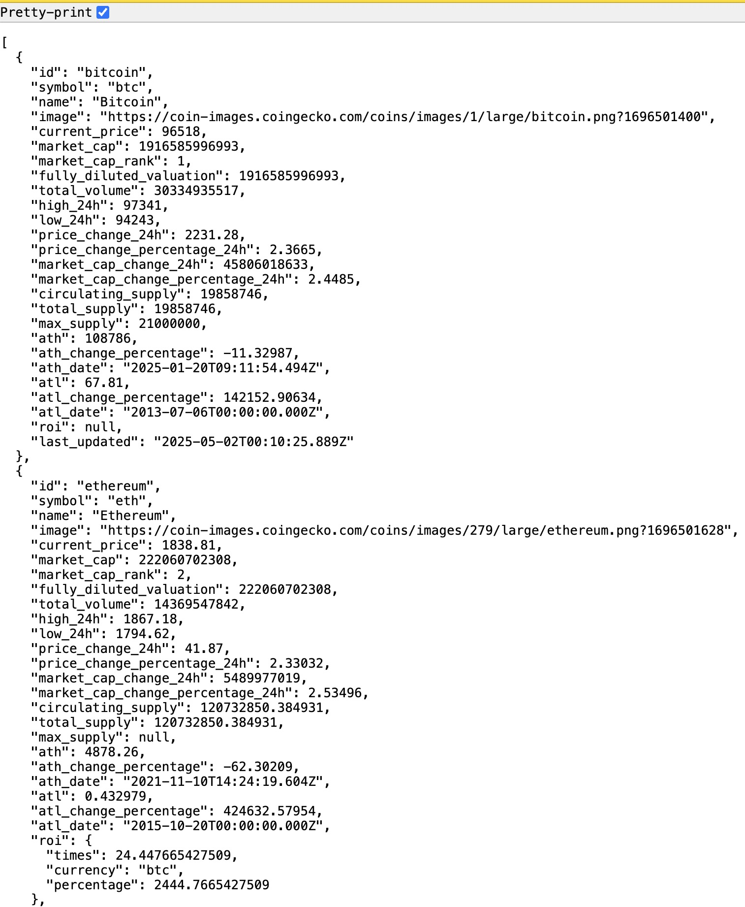
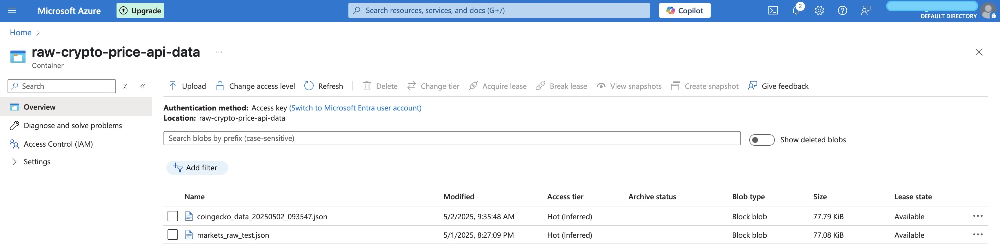
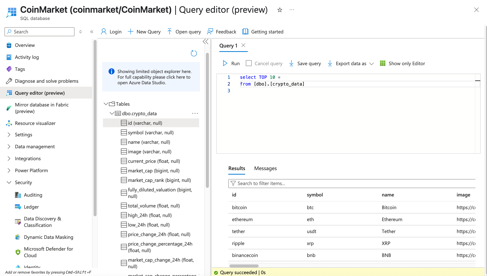

# CryptoTracker

A Python utility that fetches cryptocurrency price data from CoinGecko API and stores it in Azure Blob Storage for further analysis.

## Overview

CryptoTracker is a simple yet powerful tool that:
1. Makes REST API calls to CoinGecko to retrieve the latest cryptocurrency prices
2. Formats the data into JSON
3. Saves the data locally as JSON files
4. Uploads the files to Azure Blob Storage for persistence and sharing

## Screenshots

### Raw JSON Data


### Successful Upload Confirmation


### Successful Data Load to Azure SQL Server


## Features

- **Real-time Data**: Fetches up-to-date cryptocurrency prices from CoinGecko
- **Data Persistence**: Stores historical price data in JSON format
- **Cloud Storage**: Automatically uploads data to Azure Blob Storage
- **Configurable**: Easily customize which cryptocurrencies to track

## Prerequisites

- Python 3.12
- Azure Storage Account
- CoinGecko API access (free tier works fine)

## Installation

```bash
# Clone the repository
git clone https://github.com/FangQijun/restapi-to-azure-data-factory
cd restapi-to-azure-data-factory

# Set up a virtual environment
python -m venv venv
source venv/bin/activate  # On Windows: venv\Scripts\activate

# Install dependencies
pip install -r requirements.txt
```

## Configuration

Create a `.env` file in the project root with your Azure credentials:

```
AZURE_STORAGE_CONNECTION_STRING=your_connection_string
AZURE_CONTAINER_NAME=your_container_name
SQL_SERVER=your_sql_server
SQL_DATABASE=your_sql_db
SQL_USERNAME=your_sql_db_username
SQL_PASSWORD=your_sql_db_password
```

## Usage

### Basic Usage

Run the first main script to fetch current prices from REST API and upload to Azure:

```bash
python coingecko_to_azure.py
```

Run the second main script to get connected to Azure SQL Server and upload the local `.json` file to Azure SQL Database:

```bash
python crypto_json_to_sql.py
```

## Project Structure

```
RESTAPI-TO-AZURE-DATA_FACTORY
├── CoinGecko
│   ├── data/
│   │   └── coingecko_data_20250502_09...    # JSON data file
│   ├── logs/
│   │   └── coingecko_azure_20250502-0...    # Log file
│   ├── src/                                 # Source directory
│   ├── tests/                               # Test directory
│   ├── .env                                 # Environment variables
│   ├── .gitignore                           # Git ignore file
│   ├── coingecko_to_azure.py                # Main script 1
│   ├── crypto_json_to_sql.py                # Main script 2
│   ├── poetry.lock                          # Poetry dependencies lock
│   ├── pyproject.toml                       # Project configuration
│   └── README.md                            # This file
```

## Example Data

Here's a sample of the JSON data structure:

```json
{
  "id": "bitcoin",
  "symbol": "btc",
  "name": "Bitcoin",
  "image": "https://coin-images.coingecko.com/coins/images/1/large/bitcoin.png?1696501400",
  "current_price": 96518,
  "market_cap": 1916585996993,
  "market_cap_rank": 1,
  "fully_diluted_valuation": 1916585996993,
  "total_volume": 30334935517,
  "high_24h": 97341,
  "low_24h": 94243,
  "price_change_24h": 2231.28,
  "price_change_percentage_24h": 2.3665,
  "market_cap_change_24h": 45806018633,
  "market_cap_change_percentage_24h": 2.4485,
  "circulating_supply": 19858746,
  "total_supply": 19858746,
  "max_supply": 21000000,
  "ath": 108786,
  "ath_change_percentage": -11.32987,
  "ath_date": "2025-01-20T09:11:54.494Z",
  "atl": 67.81,
  "atl_change_percentage": 142152.90634,
  "atl_date": "2013-07-06T00:00:00.000Z",
  "roi": null,
  "last_updated": "2025-05-02T00:10:25.889Z"
}
```

## Acknowledgments

- [CoinGecko API](https://www.coingecko.com/en/api) for providing cryptocurrency data
- [Azure Blob Storage](https://azure.microsoft.com/en-us/services/storage/blobs/) for cloud storage solutions